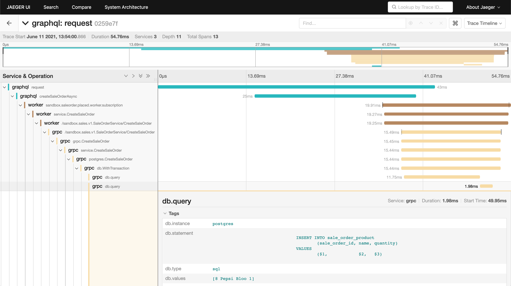
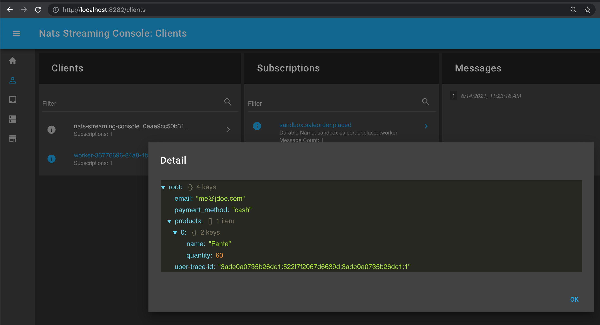

## trace-sandbox
Trace sandbox is a project to showcase a poc of distributed systems with message queue, graphql, grpc, http server with added monitoring and tracing capabilities.

## Prerequisites

This project requires

  - [Docker](https://docs.docker.com/get-docker/)
  - [Docker Compose](https://docs.docker.com/compose/install/#install-compose)

## Getting Started

### Usage

To start all the provided services and its dependencies, run `docker-compose`

```bash
docker-compose -f docker/docker-compose.yml up
```

This will start `postgres`, `nats-streaming-server`, `jaeger` and our collection of services.

## Testing

To test each service independently, please refer to the readme provided for each service

  - [grpc](grpc/README.md)
  - [graphql](graphql/README.md)
  - [http](http/README.md)
  - [worker](worker/README.md)

To see the trace on `jaeger` navigate to `http://localhost:16686/search` here we are able to see trace of every processed requests



To see sent messages inside nats streaming navigate to `http://localhost:8282/server` and use `host.docker.internal` when asked for `hostname` (only if you are using `docker-compose`)


