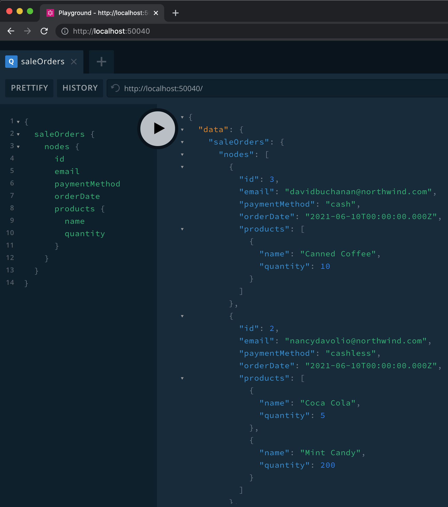

# graphql

This project contains graphql example for sale order services using `apollo-server` in `typescript` communicating with `grpc` server and `nats streaming` with added tracing capabilities.

## Prerequisites

This project requires

- [nodejs 12](https://nodejs.org/en/)
- [yarn](https://yarnpkg.com/en/docs/install)

## Getting Started

### Installation

```sh
yarn install # or npm install
```

### Usage

Setup `.env` file according to template provided in `.env.sample`, then run locally using

```sh
yarn serve:watch   # or npm run serve:watch
```

## Testing

Open your browser at [http://localhost:50040](http://localhost:50040) and start sending queries.

**Query sample:**

```graphql
{
  saleOrders {
    nodes {
     	id
      email
      paymentMethod
      orderDate
      products {
        name
        quantity
      } 
    }
  }
}
```

The server should return the following response:

```json
{
  "data": {
    "saleOrders": {
      "nodes": [
        {
          "id": 3,
          "email": "davidbuchanan@northwind.com",
          "paymentMethod": "cash",
          "orderDate": "2021-06-10T00:00:00.000Z",
          "products": [
            {
              "name": "Canned Coffee",
              "quantity": 10
            }
          ]
        },
        {
          "id": 2,
          "email": "nancydavolio@northwind.com",
          "paymentMethod": "cashless",
          "orderDate": "2021-06-10T00:00:00.000Z",
          "products": [
            {
              "name": "Coca Cola",
              "quantity": 5
            },
            {
              "name": "Mint Candy",
              "quantity": 200
            }
          ]
        },
        {
          "id": 1,
          "email": "michaelsuyama@northwind.com",
          "paymentMethod": "cash",
          "orderDate": "2021-06-10T00:00:00.000Z",
          "products": [
            {
              "name": "Chicken",
              "quantity": 1
            },
            {
              "name": "Pepsi",
              "quantity": 3
            },
            {
              "name": "Momogi",
              "quantity": 10
            }
          ]
        }
      ]
    }
  }
}
```



Full documentation can be found inside the server graphql playground docs page or [graphql schema file](./src/graphql/schema.graphql)
