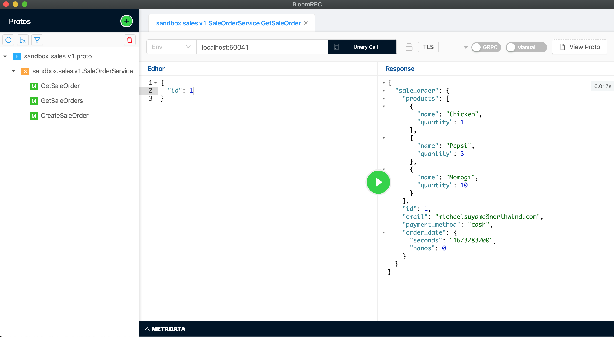

# grpc

grpc server that handles sale order requests and read/write to database.

## Prerequisites

This project requires

- [Go 1.16+](https://golang.org/)
- make

## Getting Started

### Installation

Run `make` to install dependencies.

```bash
make install
```

### Usage

Setup `.env` file according to template provided in `.env.sample`, then run locally using

```bash
make serve
```

## Testing

To test grpc server, we can either use [bloomrpc](https://github.com/uw-labs/bloomrpc) or [grpcurl](https://github.com/fullstorydev/grpcurl)

Using `Bloom RPC` import protos provided [here](../api/protobuf-spec/sandbox_sales_v1.proto) and use `localhost:50041` as server url, and start sending request.



